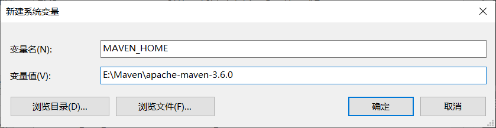

> 官网推荐的IDE有Spring Tool Suite（STS），这是一个基于Eclipse的IDE，因已经我安装了Eclipse，故不再安装STS，而是采用在Eclipse上安装插件的方式。

## Eclipse安装TST插件
打开Eclipse，选择help->Eclipse marketplace，在marketplace的Search中搜索Spring tool suite，点击install。

## 下载并安装配置maven
下载地址是http://maven.apache.org/download.cgi
下载Windows版本，`apache-maven-3.6.0-bin.zip`
解压到自定义目录，添加环境变量。新建环境变量`MAVEN_HOME` ，变量值为：**E:\Maven\apache-maven-3.6.0**
编辑系统变量`Path`，添加变量值：**;%MAVEN_HOME%\bin**
<!--  -->


配置maven仓库。进入apache-maven-3.6.0文件夹中，进入`conf`文件夹，会看到`setting.xml`文件，这是maven的配置文件。修改该文件。
找到`<localRepository>/path/to/local/repo</localRepository>`，这是本地仓库的位置，修改成自己的文件夹。

## 在Eclipse中配置maven
打开Eclipse，选择Window->Preferences，在打开的配置页面中输入maven关键字进行搜索，在maven下找到`Installations`，点击`Add`按钮，选择maven的安装路径，点击`Apply`。
接着在maven下找到`User Settings`。User Settings有两个设置框，Global Settings（全局配置信息）和User Settings（只针对这个工作空间进行设置）。根据自己的实际情况设置相应的settings文件。点击User Settings后的Browse按钮，选择之前配置的maven的配置文件`settings.xml`，点击`Update Settings`按钮，再点击下面的`Apply`按钮。